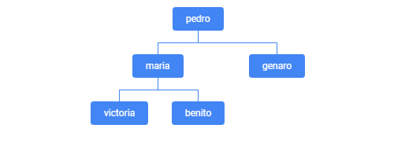

# Manual de Usuario

## Índice

1. [Introducción](#introducción)
2. [Requisitos](#requisitos)
3. [Instalación](#instalación)
4. [Uso del Programa](#uso-del-programa)
    - [Menú Principal](#menú-principal)
    - [Ingresar Nuevo Miembro](#ingresar-nuevo-miembro)
    - [Eliminar Miembro](#eliminar-miembro)
    - [Buscar Miembro de la familia](#buscar-miembro-de-la-familia)
    - [Imprimir Árbol Genealógico](#imprimir-árbol-genealógico)
    - [Imprimir Relación entre Miembros](#buscar-relación-entre-miembros)
    - [Importar o Exportar Árbol Genealógico](#importar-o-exportar-árbol-genealógico)
5. [Funciones Adicionales](#funciones-adicionales)
    - [Calcular Edad](#calcular-edad)
    - [Ordenar Miembros por Edad](#ordenar-miembros-por-edad)
    - [Liberación de Memoria](#liberación-de-memoria)
    - [Verificar Entrada](#verificar-entrada)

6. [Ejemplo de Uso](#ejemplo-de-uso)
7. [Cómo Visualizar Gráficamente el Árbol Genealógico](#cómo-visualizar-gráficamente-el-árbol-genealógico)
8. [Presentación](#presentación)
9. [Conclusión](#conclusión)
10. [Autores](#autores)

## Introducción

¡Bienvenido al programa de gestión de árboles genealógicos! Con esta herramienta podrás llevar un registro organizado de tu familia, explorando conexiones y relaciones entre tus seres queridos a lo largo del tiempo.

## Requisitos

- Compilador compatible con C++ (por ejemplo, g++)
- Biblioteca estándar de C++
- Archivos `Funciones.h` y `ProyectoFinal_ArbolGenealogico.cc`

## Instalación

1. Clona el repositorio utilizando el siguiente comando en tu terminal:
   ```bash
   git clone ped-02-2024-proyecto-final-ped_p_final_365
   ```

2. Compila el programa con el siguiente comando:
   ```bash
   g++ -o ProyectoFinal_ArbolGenealogico ProyectoFinal_ArbolGenealogico.cc
   ```

3. Ejecuta el programa con el comando:
   ```bash
   ./ProyectoFinal_ArbolGenealogico
   ```

## Uso del Programa

### Menú Principal

Al ejecutar el programa, verás el siguiente menú:

```text
------------------------------------------------------------------------
Favor ingrese la accion que desea realizar en su arbol genealogico:
(1) Ingresar nuevo miembro
(2) Eliminar miembro
(3) Buscar un miembro de la familia
(4) Imprimir arbol completo
(5) Imprimir relacion entre miembros familiares
(6) Importar o Exportar arbol genealogico
(7) Salir
------------------------------------------------------------------------
```

### Ingresar Nuevo Miembro

Para agregar un nuevo miembro a tu árbol genealógico, selecciona la opción `(1)` e ingresa los detalles solicitados (nombre, año de nacimiento, nombre de la madre y del padre).

### Eliminar Miembro

Para eliminar un miembro del árbol, selecciona la opción `(2)`, muestra los miembros disponibles y especifica el nombre del miembro a eliminar.

### Buscar Miembro de la familia

Para buscar miembros por nombre, selecciona la opción `(3)` e ingresa el nombre del miembro a buscar.

### Imprimir Árbol Genealógico

Para imprimir el árbol genealógico completo, selecciona la opción `(4)`.

### Buscar Relación entre Miembros

Para buscar la relación entre miembros familiares, selecciona la opción `(5)` e ingresa el nombre del miembro para ver sus relaciones directas.

### Importar o Exportar Árbol Genealógico

Para importar o exportar el árbol genealógico, selecciona la opción `(6)`. Luego elige entre importar un archivo `.csv` o exportar el árbol genealógico a un archivo `.csv`.

## Funciones Adicionales

### Calcular Edad

Para calcular la edad de un miembro, el programa utiliza la función `calcularEdad`, que determina la edad basándose en el año actual y el año de nacimiento del miembro.

### Ordenar Miembros por Edad

El programa puede ordenar los miembros por edad utilizando la función `ordenarMiembrosPorEdad`. Esto es útil para listar los miembros en orden de antigüedad.

### Liberación de Memoria

Antes de salir del programa, la memoria utilizada por los nodos del árbol genealógico será liberada automáticamente.

### Verificar Entrada

Al momento de ingresar un entero como es en el caso de ingresar la edad, la función `verificarEntrada` verifica que en verdad sea un entero y de no ser asi, vuelve a solicitar los datos evitando así un bucle infinito.

## Ejemplo de Uso

Imaginemos que quieres agregar a un nuevo miembro llamado "María López" nacida en 1990, con madre "Ana Gómez" y padre "Carlos López". El flujo sería algo así:

1. Selecciona la opción `(1)` para ingresar un nuevo miembro.
2. Ingresa los detalles:
   ```text
   Ingrese el nombre del miembro: María López
   Ingrese el anio nacimiento del miembro: 1990
   Ingrese el nombre de la madre (o deje en blanco): Ana Gómez
   Ingrese el nombre del padre (o deje en blanco): Carlos López
   ```
3. El programa confirmará la adición del nuevo miembro:
   ```text
   Miembro María López agregado exitosamente con madre Ana Gómez y padre Carlos López.
   ```

Ahora, María López ha sido agregada a tu árbol genealógico, y puedes explorar más relaciones y detalles utilizando las otras opciones del menú.


## Cómo Visualizar Gráficamente el Árbol Genealógico

Para visualizar el árbol genealógico de manera gráfica utilizando Excel, sigue estos pasos:

1. **Generar los Datos**: Asegúrate de que tu árbol genealógico está correctamente ingresado en el programa y exporta el árbol a un archivo `.csv` utilizando la opción `(6)` del menú.
2. **Abrir Excel**: Abre Microsoft Excel en tu computadora.
3. **Importar el Archivo CSV**:
   - Ve a `Archivo` -> `Importar`.
   - Selecciona `Subir`, luego `Examinar` y busca el archivo `.csv` exportado.
   - Selecciona `Cargar`.
4. **Reemplazar la Hoja Actual**:
   - En la ventana de importación, selecciona `Reemplazar la hoja actual`.
   - Haz clic en `Importar datos`.
5. **Generar la Tabla**:
   - Se generará una tabla con los datos importados.
   - Selecciona todos los datos excepto la columna del año de nacimiento.
   - Asegúrate de seleccionar solo las celdas con datos, sin dejar espacios vacíos.
6. **Insertar Gráfico**:
   - Ve a la pestaña `Insertar`.
   - Selecciona `Gráfico`.
   - En `Tipo de gráfico`, selecciona `Organigrama`.
   - Baja hasta seleccionar la opción `Usar la fila 1 como encabezado`.


### Imagen de Ejemplo

 

### Presentación

https://www.canva.com/design/DAGW18ytwUo/873okc5Z_svlikmxiV0cmA/edit?utm_content=DAGW18ytwUo&utm_campaign=designshare&utm_medium=link2&utm_source=sharebutton

## Conclusión

Este programa facilita la gestión de un árbol genealógico, permitiendo mantener un registro organizado y completo de los miembros familiares. ¡Explora las conexiones familiares y descubre más sobre tu historia familiar!

## Autores

Este proyecto fue creado por:
- Alejandro Alvarenga
- Ana Hernández
- Diego Carrillo
- Mateo Vargas
